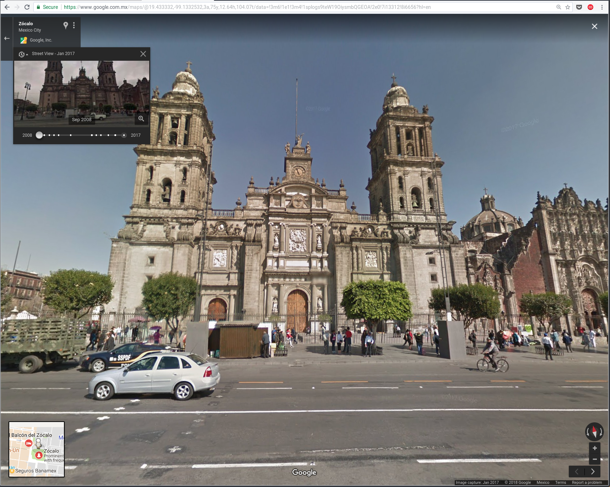

[Delta Lab](https://links.deltalab.ai/website) | [Twitter](https://links.deltalab.ai/twitter) | [LinkedIn](https://links.deltalab.ai/linkedin)

---

# Detecting urban evolution with computer vision

- Omar Trejo
- January, 2018

Objective: replicate the methodology used by Nail (et al) papers:

- [Computer vision uncovers predictors of physical urban change (2017)](http://www.pnas.org/content/114/29/7571.full)
- [Do people shape cities or do cities shape people? (2015)](http://www.nber.org/papers/w21620)

General steps:

1. Collect historical images from urban locations
2. Use computer vision to extract feature vectors from images
3. Provide an estimate for a "safety" score for each location

# 1. Collect historical images from urban locations

To get historical images from urban locations we use Google Street View. Getting
current images is straightforward, but getting historical images is very hard
(Google actively makes it hard to retrieve those images, for a reason unknown to
me). Therefore, I split this step in two parts:

1. Specification of current images
2. Specification of historical images

## 1.1 Specification of current images

Google Street View provides a dynamic interface were a user can explore the
street by "navigating" it with point-click mouse operations. This exploration
mechanism is useful, but does not provide an easy way to extract the directions,
angles, and zoom-levels desired for the images that will be retrieved. To
overcome this problem I built a web application that provides more rudimentary
controls, but allows the user to precisely define the image that should be
stored for the analysis.

The web application also provides a mechanism to download the set of images that
the user decides to collect into a file called `images.json` which can be used
as input to later retrieve the corresponging images. The purpose of this
mechanism is to provide a clean way to save the location metadata while avoiding
human errors, by avoiding writing the metadata down or copy-pasting into a file
which may not even be in the format required by the other parts of the system.

Web application: https://otrenav.gitlab.io/google-street-view-image-explorer/

The user must input:

- `Latitude` (number)
- `Longitude` (number)
- `Heading` (number)
    - Used to determine direction in which the camera is pointed as if we were
      standing at that precise coordinates. Valid values are between 0 and 360,
      where 0 (as well as 360) is North, 90 is East, 180 is South, and 270 is
      West.
- `FOV` (number)
    - "Field of view" value used to indicate zoom level. Valid values are
      between 20 and 120, where 20 is the "closest" zoom and 120 is the
      "furthest" zoom.
- `Pitch` (number)
    - Angle for the camera. Valid values are between -90 and 90, where -90 is
      straight down and 90 is straight up.

When the user has selected an image that should be later retrieved for analysis,
he should click the "Add to list" button, and the metadata for the location's
image (the attributes shown above) should be added to the  list in the box
below. The user may now go ahead an explore a new image, and repeat. Once the
user wants to download the metadata for all the images selected during the
session, he should click the "Download" button which downloads the `images.json`
file to disk. That file should be provided to Omar Trejo (otrenav@gmail.com) to
be used as input in the next steps of the analysis.

## 1.2 Specification of historical images

The Google Street View web application has a feature to see images for previous
dates. However, those images are very well protected from users trying to access
them. In this section I describe the process (in progress) being built to
retrieve such images. The following image shows such feature:

|                                                                                             |
|------------------------------------------------------------------------------------------------------------------------------------------------------|
| URL: https://www.google.com.mx/maps/@19.433332,-99.1332532,3a,75y,12.64h,104.07t/data=!3m6!1e1!3m4!1splogs9teW19OiysmbQGEOA!2e0!7i13312!8i6656?hl=en |

Since those images are sent to the web browser, we can reverse engineer them,
and that's what I'm currently working on. The process is described below.

First, I inspected the requests performed by the web browser when it loads the
data for a location like the one shown above. In there, I found the following
request, where `<LONG>` and `<LAT>` were substituted by the coordinates of the
current position in the web application.

```
"https://maps.googleapis.com/maps/api/js/GeoPhotoService.SingleImageSearch?
pb=!1m5!1sapiv3!5sUS!11m2!1m1!1b0!2m4!1m2!3d<LAT>!4d<LONG>!2d100!3m18!2m2!1sen!
2sUS!9m1!1e2!11m12!1m3!1e2!2b1!3e2!1m3!1e3!2b1!3e2!1m3!1e10!2b1!3e2!4m6!1e1!1e2!
1e3!1e4!1e8!1e6&callback=_xdc_._2kz7bz"
```

The previous requests return a JavaScript file which includes the metadata used
to retrieve the historical images. That response is heavily obfuscated and very
large. A portion of it is shown below:

```
/**/_xdc_._2kz7bz && _xdc_._2kz7bz( [[0],[[1],[2,"8BYbV9yGx9_KFZGruS4ADw"],
[2,2,[6656,13312],[[[[208,416]],[[416,832]],[[832,1664]],[[1664,3328]],[[3328,6656]],
[[6656,13312]]],[512,512]],null,null,null,null,null,"8BYbV9yGx9_KFZGruS4ADw"],[null,
null,[["Zócalo","en"],["Mexico City","en"]]],[[[["© 2018 Google"]]]],[[[1],[[null,null,
19.43338063938084,-99.13306567734493],[2230.93115234375],[279.19384765625,
91.93980407714844,0.2056157886981964],null,"MX"],null,[[[[2,"8BYbV9yGx9_KFZGruS4ADw"],
null,[[null,null,19.43338063938084,-99.13306567734493],[2230.93115234375],
[279.19384765625,91.93980407714844,0.2056157886981964]]],[[2,"ueGD_R9pRVKYH-qjz_jtTQ"],
null,[[null,null,19.43338932668196,-99.13311771900089],[2230.9638671875],
[279.5500793457031,91.50520324707031,0.3748516142368317]]],[[2,"ijYDIm2NOvg6jWn-iKF6Ew"],
null,[[null,null,19.43335374708528,-99.13290525515447],[2230.879150390625],
[279.7347412109375,91.91959381103516,0.3031580150127411]],[null,null,[["Zócalo","en"]]]],
...
```

After cleaning it up, we can see some structures stand out.

```
[
    [0],
    [
        [1],
        [2, "8BYbV9yGx9_KFZGruS4ADw"],
        [2, 2, [6656, 13312],
            [
                [
                    [
                        [208, 416]
                    ],
                    [
                        [416, 832]
                    ],
                    [
                        [832, 1664]
                    ],
                    [
                        [1664, 3328]
                    ],
                    [
                        [3328, 6656]
                    ],
                    [
                        [6656, 13312]
                    ]
                ],
                [512, 512]
            ], null, null, null, null, null, "8BYbV9yGx9_KFZGruS4ADw"
        ],
        [null, null, [
            ["Zócalo", "en"],
            ["Mexico City", "en"]
        ]],
        [
            [
                [
                    ["© 2018 Google"]
                ]
            ]
        ],
        [
            [
                [1],
                [
                    [null, null, 19.43338063938084, -99.13306567734493],
                    [2230.93115234375],
                    [279.19384765625, 91.93980407714844, 0.2056157886981964], null, "MX"
                ], null, [
                    [
                        [
                            [2, "8BYbV9yGx9_KFZGruS4ADw"], null, [
                                [null, null, 19.43338063938084, -99.13306567734493],
                                [2230.93115234375],
                                [279.19384765625, 91.93980407714844, 0.2056157886981964]
                            ]
                        ],
                        [
                            [2, "ueGD_R9pRVKYH-qjz_jtTQ"], null, [
                                [null, null, 19.43338932668196, -99.13311771900089],
                                [2230.9638671875],
                                [279.5500793457031, 91.50520324707031, 0.3748516142368317]
                            ]
                        ],
                        [
                            [2, "ijYDIm2NOvg6jWn-iKF6Ew"], null, [
                                [null, null, 19.43335374708528, -99.13290525515447],
                                [2230.879150390625],
                                [279.7347412109375, 91.91959381103516, 0.3031580150127411]
                            ],
                            [null, null, [
                                ["Zócalo", "en"]
                            ]]
                        ],
                        [
                            [2, "wrDAaQh8XicTS58AUy4WYw"], null, [
                                [null, null, 19.43332195946453, -99.1331503763559],
                                [2230.051025390625],
                                [276.0145874023438, 91.45116424560547, -2.80112361907959]
                            ],
                            [null, null, [
                                ["Zócalo", "en"]
                            ]]
                        ],
                        [
                            [2, "LFexmeZ1Fn5CEffrqdMnxg"], null, [
                                [null, null, 19.43340429693495, -99.13320877345814],
                                [2231.065673828125],
                                [279.8168640136719, 91.02687072753906, 0.08696687966585159]
                            ]
                        ],
                        [
                            [2, "DjK2nERq_Y37Gn7VJKZ2-g"], null, [
                                [null, null, 19.43331849875, -99.13271174970211],
                                [2230.929443359375],
                                [280.1111755371094, 91.89283752441406, -0.153510183095932]
                            ]
                        ],
                        [
                            [2, "SDQj5O2gCEWQJqQnguz63w"], null, [
                                [null, null, 19.43303945050903, -99.13305915046254],
                                [2232.45849609375],
                                [310.9834899902344, 83.57907104492188, 0.3605626821517944]
                            ]
                        ],
                        [
                            [2, "eZBJBSvx5ihFTMuEzVGcpA"], null, [
                                [null, null, 19.43342543727122, -99.13333168732539],
                                [2230.952880859375],
                                [280.2865905761719, 90.96880340576172, -0.1985620558261871]
                            ]
                        ],
                        [
                            [2, "rJNQpa4YzZR67uavMDifZQ"], null, [
                                [null, null, 19.43333641111737, -99.13280818732001],
                                [2230.90478515625],
                                [280.1854858398438, 92.01342010498047, 0.1685637086629868]
                            ]
                        ],
                        [
                            [10, "AF1QipNSN0W-t-hdoQZ8tocIYvC51IXmTuwvBVS8RaNS"], null, [
                                [null, null, 19.43364656514633, -99.13264470222893], null, [-14.59226036071777]
                            ]
                        ],
                        [
                            [2, "2grebsBgPxbvbpmuInRHoQ"], null, [
                                [null, null, 19.43345782132867, -99.13352094333885],
                                [2230.734130859375],
                                [280.2164611816406, 91.24728393554688, 0.3754258453845978]
                            ]
                        ],
                        [
                            [2, "rvt_zzYvhmOEBWC0wXyhZg"], null, [
                                [null, null, 19.43299958051849, -99.13302432686723],
                                [2232.36865234375],
                                [308.541748046875, 84.90728759765625, -0.7074112892150879]
                            ]
                        ],
                        [
                            [2, "W04CNhybIuIw0AZdnKSPyg"], null, [
                                [null, null, 19.43343975341989, -99.13341335885089],
                                [2230.8662109375],
                                [280.4949951171875, 90.98735809326172, 0.1180841252207756]
                            ]
                        ],
                        [
                            [2, "yYGlR19b-Ehshz7m6LUtFQ"], null, [
                                [null, null, 19.43295745444837, -99.13298191814022],
                                [2232.41455078125],
                                [316.7716979980469, 83.53802490234375, -0.5264188051223755]
                            ]
                        ],
                        [
                            [2, "02Xmy0IRzaKDLYjARoeypQ"], null, [
                                [null, null, 19.43330023484216, -99.13260917658539],
                                [2230.9921875],
                                [279.7233276367188, 91.57112884521484, -0.03463900461792946]
                            ]
                        ],
                        [
                            [10, "AF1QipPjyYgjmLAND6EVHm1wbramwYq3HWrG94ET17IP"], null, [
                                [null, null, 19.43397462331893, -99.13323079797487], null, [312.4321594238281, 85.90000152587891, -1],
                                []
                            ]
                        ],
                        [
                            [2, "f2xTJZLM9MhdNe16OmRStQ"], null, [
                                [null, null, 19.4331601422769, -99.13230394220253],
                                [2231.352783203125],
                                [333.4890747070312, 90.82357788085938, 1.858689785003662]
                            ]
                        ],
                        [
                            [2, "Qv9AtkHW8yHd1V0OdL4h7g"], null, [
                                [null, null, 19.43341478348614, -99.13234341408703],
                                [2230.268798828125],
                                [14.67795181274414, 90.99549102783203, -1.85239040851593]
                            ]
                        ],
                        [
                            [2, "Um2fG39TliW_tJFgSZ4lSg"], null, [
                                [null, null, 19.43307414082382, -99.1322749981797],
                                [2231.030517578125],
                                [355.0272827148438, 91.13957977294922, 2.389007568359375]
                            ]
                        ],
                        [
                            [10, "AF1QipMQ5QTNUUcUumtDH76BFDItp0uisFiGaJBpl2kY"], null, [
                                [null, null, 19.43368148575906, -99.13377664983273], null, [124.4440002441406],
                                []
                            ]
                        ],
                        [
                            [2, "plogs9teW19OiysmbQGEOA"], null, [
                                [null, null, 19.43333203653752, -99.13325322206083],
                                [2230.026611328125],
                                [276.2357482910156, 91.08800506591797, -2.489231824874878]
                            ]
                        ],
                        [
                            [2, "tXHGk1gaggvUQr_yYpXHMg"], null, [
                                [null, null, 19.43297929066159, -99.13227543369891],
                                [2230.748779296875],
                                [5.348486423492432, 90.97550201416016, 0.9500747323036194]
                            ]
                        ],
                        [
                            [10, "AF1QipNNjmLw4lhjbkuotO0BDdxiC-zalJsQ99i8UeV_"], null, [
                                [null, null, 19.43324137023327, -99.13328245282173], null, [12.85000038146973],
                                []
                            ]
                        ],
                        [
                            [2, "9t9OQ1hVftsda7ngwUbKiw"], null, [
                                [null, null, 19.43306055225127, -99.13310677598169],
                                [2232.18603515625],
                                [281.4844970703125, 85.12648773193359, -0.04584505781531334]
                            ]
                        ],
                        [
                            [2, "r02HBgtAaClWZQ049AZzMg"], null, [
                                [null, null, 19.43306993946899, -99.13328630485672],
                                [2230.46728515625],
                                [102.8705444335938, 83.97099304199219, -2.069784641265869]
                            ]
                        ],
                        [
                            [2, "fL2_YGjceJNZ2uIBqQlu-w"], null, [
                                [null, null, 19.43309527345593, -99.13321391600684],
                                [2231.96435546875],
                                [280.3670349121094, 85.03311920166016, 0.5365882515907288]
                            ]
                        ],
                        [
                            [2, "JxlbX6-N6Wy5FmWNHoLUCQ"], null, [
                                [null, null, 19.43307776058327, -99.13315877200071],
                                [2231.714599609375],
                                [292.888427734375, 85.03935241699219, 0.373618483543396]
                            ]
                        ],
                        [
                            [2, "EepqbXuA6-MpikpW0KFMWA"], null, [
                                [null, null, 19.43415963048021, -99.13401999325762],
                                [2232.415283203125],
                                [4.52302074432373, 91.78837585449219, -1.118253707885742]
                            ]
                        ],
                        [
                            [2, "9ijyJ2Ccrtc4yU2Zfb2lVg"], null, [
                                [null, null, 19.43328990454815, -99.13255211384343],
                                [2231.0712890625],
                                [281.2297668457031, 92.18199157714844, -0.2424485981464386]
                            ]
                        ],
                        [
                            [2, "rqqZ3SSUrCJZZAEeSV2_6w"], null, [
                                [null, null, 19.43399001034999, -99.13421959508912],
                                [2233.589599609375],
                                [96.83889770507812, 90.42226409912109, 1.802307963371277]
                            ]
                        ],
                        [
                            [2, "Vo8aFCTUHN0giYYM2eh1Tw"], null, [
                                [null, null, 19.43294960721951, -99.1330722728848],
                                [2230.639892578125],
                                [151.5646057128906, 86.21858978271484, -0.2969843447208405]
                            ]
                        ],
                        [
                            [2, "1bdZs-0qVZYlwLqrBi4Vtg"], null, [
                                [null, null, 19.43335436396238, -99.13345390517362],
                                [2229.891845703125],
                                [277.1900329589844, 91.04969787597656, -1.939778208732605]
                            ]
                        ],
                        [
                            [2, "S1bRLhsPfJNIqi4bhBf9fg"], null, [
                                [null, null, 19.43334294524688, -99.13335510213707],
                                [2229.955810546875],
                                [276.8914184570312, 91.22176361083984, -2.119887828826904]
                            ]
                        ],
                        [
                            [2, "np7ttZCaQkMAAAQvOznUmw"], null, [
                                [null, null, 19.43383939391298, -99.13432450213412],
                                [2246.740478515625],
                                [70.29188537597656, 90, 0],
                                ["12293407136835371008"]
                            ]
                        ],
                        [
                            [2, "vPC87gUJQ7fj-ta-LjZzXA"], null, [
                                [null, null, 19.43400401025488, -99.13432633591735],
                                [2234.010009765625],
                                [98.4635009765625, 90.24544525146484, 0.939511239528656]
                            ]
                        ],
                        [
                            [2, "b1E7KOaF8aKPn4obhoXkpw"], null, [
                                [null, null, 19.43401659261591, -99.13441728834935],
                                [2234.544189453125],
                                [98.36923217773438, 90.70249938964844, 1.048835515975952]
                            ]
                        ],
                        [
                            [2, "ZY6vyD3Ry_KUoAMW6xTr_g"], null, [
                                [null, null, 19.43317120303236, -99.13395430817221],
                                [2229.7236328125],
                                [197.8207702636719, 91.32144165039062, 1.403136372566223]
                            ]
                        ],
                        [
                            [2, "lSBGzYzIjk4Ji8xfWNr2zw"], null, [
                                [null, null, 19.4334832561433, -99.13364617789149],
                                [2230.7041015625],
                                [284.7068481445312, 91.19657897949219, 0.1161661073565483]
                            ]
                        ],
                        [
                            [2, "dZJeSBMxGeM_xkIK2iZbrw"], null, [
                                [null, null, 19.43289169039565, -99.13228496919032],
                                [2230.579345703125],
                                [6.227925777435303, 90.64614868164062, 0.3811902105808258]
                            ]
                        ],
                        [
                            [2, "oNhqJ9B5XXnFobGst_Z8rQ"], null, [
                                [null, null, 19.43336604014468, -99.13355140541837],
                                [2229.862060546875],
                                [277.298095703125, 90.79946899414062, -1.676334381103516]
                            ]
                        ],
                        [
                            [2, "8-UCzXolmSgupmJ4jAyURA"], null, [
                                [null, null, 19.43332216673397, -99.13237469921515],
                                [2229.813720703125],
                                [6.775060176849365, 94.57952117919922, -3.961466550827026]
                            ]
                        ],
                        [
                            [2, "o49EKXM3ohwcJYGzkk1FRw"], null, [
                                [null, null, 19.43334964297456, -99.13376206922405],
                                [2229.615234375],
                                [251.8185424804688, 92.28385162353516, -0.03161947429180145]
                            ]
                        ],
                        [
                            [2, "nN2r4wF1FNT6d6-MMjVJsQ"], null, [
                                [null, null, 19.43397932434061, -99.13411439752608],
                                [2232.72705078125],
                                [99.09854125976562, 91.02137756347656, 1.473838686943054]
                            ]
                        ],
                        [
                            [2, "TbPgsKadJZqNyc5XwAS1UQ"], null, [
                                [null, null, 19.43327822697482, -99.13249632520225],
                                [2231.177001953125],
                                [283.8775634765625, 91.25074005126953, 0.1476805806159973]
                            ]
                        ],
                        [
                            [2, "6LIb9007nEbsrSAkmp651Q"], null, [
                                [null, null, 19.43404872880791, -99.13402632473243],
                                [2232.265625],
                                [0.0732431560754776, 90.73674011230469, -1.131167888641357]
                            ]
                        ],
                        [
                            [2, "UwcwDtZMkeINyaSDjtggNg"], null, [
                                [null, null, 19.43342851356567, -99.13406730285065],
                                [2231.280029296875],
                                [183.9790344238281, 90.99667358398438, 1.49416983127594]
                            ]
                        ],
                        [
                            [2, "oK_1-YhGSvQeHMr8pQKG3Q"], null, [
                                [null, null, 19.43326073682227, -99.13243492012964],
                                [2231.307861328125],
                                [292.2147827148438, 91.64263916015625, 0.7466825246810913]
                            ]
                        ],
                        [
                            [2, "Ku8AyU9nqnLdmh-3Uan6IQ"], null, [
                                [null, null, 19.43304463564439, -99.13319808621023],
                                [2231.451416015625],
                                [116.8701705932617, 84.56207275390625, 1.400441527366638]
                            ]
                        ],
                        [
                            [2, "3BfoF30kPTe1U6s8Llldrg"], null, [
                                [null, null, 19.43301677780799, -99.13315703928946],
                                [2230.87060546875],
                                [129.6587066650391, 86.41114044189453, -1.877534508705139]
                            ]
                        ],
                        [
                            [2, "pv1_ewv1RHcAAAQvOznUkg"], null, [
                                [null, null, 19.43382392921768, -99.13419654850628],
                                [2246.740234375],
                                [102.996223449707, 90, -0],
                                ["12293407136835371008"]
                            ]
                        ],
                        [
                            [2, "k2VP9_-_n-A-H-K5WXSR9Q"], null, [
                                [null, null, 19.43337519900408, -99.13363723831277],
                                [2229.822509765625],
                                [275.384033203125, 91.18600463867188, -1.344803094863892]
                            ]
                        ],
                        [
                            [2, "7tONj97bfuAK0tPVKaijuA"], null, [
                                [null, null, 19.43354309383828, -99.13379300726734],
                                [2230.908447265625],
                                [301.4532775878906, 91.14462280273438, -0.01496491488069296]
                            ]
                        ],
                        [
                            [2, "NeLsza425f6y0RIsOon8qg"], null, [
                                [null, null, 19.43358642771559, -99.13405433666752],
                                [2231.71630859375],
                                [186.8444976806641, 90.29713439941406, 1.900872111320496]
                            ]
                        ],
                        [
                            [2, "nPUAI2eMBfL63fm8Rlx8rA"], null, [
                                [null, null, 19.43365634301529, -99.1339063125528],
                                [2231.416259765625],
                                [326.8971557617188, 90.63015747070312, -0.02327185682952404]
                            ]
                        ],
                        [
                            [2, "O0bvvsuOYinLaPJ1l0Lmqw"], null, [
                                [null, null, 19.43298794688629, -99.13311437817728],
                                [2230.895751953125],
                                [123.7582168579102, 84.97708892822266, -1.234461665153503]
                            ]
                        ],
                        [
                            [2, "2F4VwjLltvMAAAQvOznUmA"], null, [
                                [null, null, 19.43385433974715, -99.13445280622886],
                                [2246.74072265625],
                                [92.61809539794922, 90, -0],
                                ["12293407136835371008"]
                            ]
                        ],
                        [
                            [2, "KYqLec4osFUkc0N1rowX3Q"], null, [
                                [null, null, 19.43331069315697, -99.13408042743374],
                                [2231.089111328125],
                                [187.2951202392578, 91.03889465332031, 2.309384346008301]
                            ]
                        ],
                        [
                            [2, "zuxGsQTVh2A0cWgwYDUdwA"], null, [
                                [null, null, 19.43323301927438, -99.13237667254393],
                                [2231.38720703125],
                                [305.9463500976562, 91.47304534912109, 1.50165855884552]
                            ]
                        ],
                        [
                            [2, "RncVMaeSwwNC2W8SS3Xo_g"], null, [
                                [null, null, 19.43372978112796, -99.13394982134766],
                                [2231.669921875],
                                [332.8725280761719, 91.21197509765625, -0.5271867513656616]
                            ]
                        ],
                        [
                            [2, "pn4ZOsT2hHStveJyv8odxw"], null, [
                                [null, null, 19.4333285411422, -99.1338150624327],
                                [2229.59912109375],
                                [245.3314514160156, 91.47579956054688, -0.7703676819801331]
                            ]
                        ],
                        [
                            [10, "AF1QipNyjmvtnU55Fdk_6gXKZTNc2s08dqgNZGm8SjsH"], null, [
                                [null, null, 19.43421044486661, -99.13386013358831], null, [0],
                                []
                            ]
                        ],
                        [
                            [2, "nYwFmFWsDTfxbieNrojbeA"], null, [
                                [null, null, 19.43349863213105, -99.13369662439135],
                                [2230.725830078125],
                                [289.2650146484375, 91.22755432128906, 0.3362585008144379]
                            ]
                        ],
                        [
                            [2, "P3bMJuqCUkkAAAQvOznUoQ"], null, [
                                [null, null, 19.43387756422387, -99.13451136265883],
                                [2246.74072265625],
                                [99.15329742431641, 90, -0],
                                ["12293407136835371008"]
                            ]
                        ],
                        [
                            [2, "PmHXaXPBI562L4AAdYRfPQ"], null, [
                                [null, null, 19.43367471944987, -99.13404407465242],
                                [2231.784912109375],
                                [185.8039398193359, 90.50267028808594, 1.407171368598938]
                            ]
                        ],
                        [
                            [10, "AF1QipON5eq-CEeNinkPpL4EXOqpfTgRX-ZUp7kCO6AJ"], null, [
                                [null, null, 19.4337976007183, -99.13437418654303],
                                [2230.572998046875],
                                [359.0469360351562]
                            ]
                        ],
                        [
                            [2, "fvH38P1p6GivOBx8KAeIXA"], null, [
                                [null, null, 19.43372445492428, -99.13403916378478],
                                [2231.80810546875],
                                [184.6484069824219, 90.83956909179688, 0.8313778042793274]
                            ]
                        ],
                        [
                            [10, "AF1QipMKk5NMPb2_2ZDE2xpV-jHO_UTaS0lzsxk39kbZ"], null, [
                                [null, null, 19.43381780845325, -99.13432014838531],
                                [2230.572998046875],
                                [28.42437553405762]
                            ]
                        ],
                        [
                            [2, "QMK-SC90YHvJdUe6U2Z7zA"], null, [
                                [null, null, 19.43407834656593, -99.13493465941066],
                                [2234.885986328125],
                                [98.29946899414062, 91.90252685546875, 1.043199777603149]
                            ]
                        ],
                        [
                            [2, "c__0AbI1OMZ2pnyIZWL4hg"], null, [
                                [null, null, 19.43338014205697, -99.13307057561222],
                                [2230.644287109375],
                                [279.7990112304688, 90.94108581542969, -0.2174169421195984]
                            ],
                            [null, null, [
                                ["Zócalo", "en"]
                            ]]
                        ],
                        [
                            [2, "QNxqOgbnCpLpCG6n3HxIyA"], null, [
                                [null, null, 19.43339304067841, -99.13305858385117],
                                [2231.43505859375],
                                [282.97119140625, 91.19746398925781, 0.1409565210342407]
                            ],
                            [null, null, [
                                ["Zócalo", "en"]
                            ]]
                        ],
                        [
                            [2, "ODgv9xvp2osKGmZG_rr8zw"], null, [
                                [null, null, 19.43337066837244, -99.13307925438433],
                                [2230.592529296875],
                                [278.6693115234375, 91.67646026611328, -0.1092027500271797]
                            ],
                            [null, null, [
                                ["Zócalo", "en"]
                            ]]
                        ],
                        [
                            [2, "Dr2RbpgtfdSDaonfu274Jg"], null, [
                                [null, null, 19.4333712690062, -99.13308455337145],
                                [2230.93310546875],
                                [279.6099548339844, 89.50065612792969, 0.5493002533912659]
                            ],
                            [null, null, [
                                ["Zócalo", "en"]
                            ]]
                        ],
                        [
                            [2, "h4aIo8FJL96ftqz8y2CTBw"], null, [
                                [null, null, 19.4333592418286, -99.13304773452654],
                                [2230.86962890625],
                                [268.7546691894531, 89.50843811035156, -0.6409784555435181]
                            ],
                            [null, null, [
                                ["Zócalo", "en"]
                            ]]
                        ],
                        [
                            [2, "A0L5QebSSk2uwvzIw-3D_g"], null, [
                                [null, null, 19.43336750128777, -99.13310617001976],
                                [2230.851806640625],
                                [282.3265991210938, 93.24763488769531, -1.573790311813354]
                            ],
                            [null, null, [
                                ["Zócalo", "en"]
                            ]]
                        ]
                    ]
                ], null, null, [
                    [3, [null, null, null, 233.6967926025391]],
                    [2, [null, null, null, 100.0797119140625]],
                    [1, [null, null, null, 280.0382080078125]]
                ], null, [
                    [68, [2016, 11]],
                    [69, [2009, 12]],
                    [70, [2009, 4]],
                    [71, [2014, 7]],
                    [72, [2014, 4]],
                    [73, [2009, 7]]
                ], null, null, null, [
                    [
                        [
                            [
                                [null, ["9642768434789341063", "12811079382263622705"]], null, ["Zócalo", "en"]
                            ]
                        ],
                        [100.0797119140625, 233.6967926025391]
                    ]
                ]
            ]
        ],
        [3, 4, 1, null, null, [null, null, null, [6]], null, [2017, 7]],
        ["https://www.google.com/cbk?cb_client=apiv3\u0026output=report\u0026image_key=!1e2!2s8BYbV9yGx9_KFZGruS4ADw"]
    ],
    [262.8540954589844]
]
```

These structure contain the data we need to extract the historical images, and
that's were the current work is taking place. I'm reverse engineering this
structures into metadata and requests that I can use to retrieve images as the
ones in the previous section.

To explain a bit more, the requests used to retrieve each of those images are of
the following form:

```
https://geo0.ggpht.com/cbk?cb_client=maps_sv.tactile&authuser=0&hl=en&gl=mx
&output=thumbnail&thumb=2&w=345&h=170&pitch=-12.828759089766265
&ll=19.35909743986499%2C-99.28230554350236
&panoid=8BYbV9yGx9_KFZGruS4ADw&yaw=25.469932294479623
```

Which includes more parameters than necessary, and we can reduce to:

```
https://geo0.ggpht.com/cbk?output=thumbnail&h=170&pitch=-12.828759089766265
&yaw=25.469932294479623&panoid=8BYbV9yGx9_KFZGruS4ADw
```

I need to find a way to translate the `HEADING`, `FOV`, and `PITCH` parameters
into the `yaw`, and `pitch` paremeters shown above (`pitch` seems to be the same
number, but `yaw` seems to have a different range, and I also need to find the
corresponding parameter for the `HEADING` parameter. These is necessary because
historical images can not be retrieved through their standard API, and need to
be retrieved through this `ge0.ggpht.com` endpoint which has a different
interface, but most have a 1-to-1 relation with the other ones because they
historical and current images can be used interchangeably in the Google Street
View web application.

## 2. Use computer vision to extract feature vectors from images

Work in progress.

## 3. Provide an estimate for a "safety" score for each location

Work in progress.

---

> "We are the people we have been waiting for."
